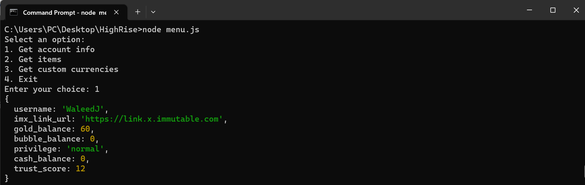
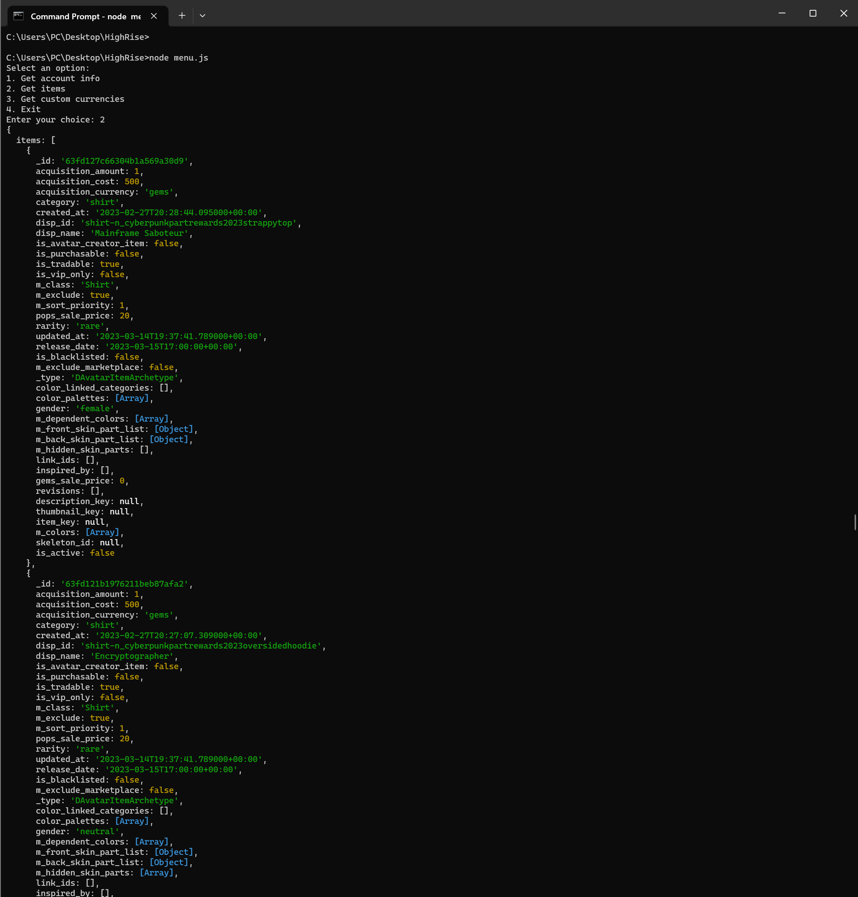
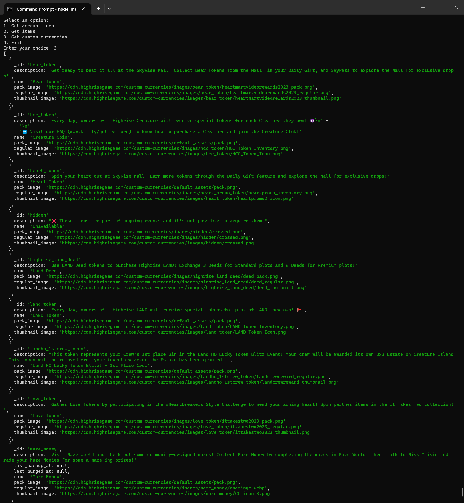

# HighriseAPI Node.js Example

This is a Node.js example of using the HighriseAPI to access your Highrise account information. It includes methods to get your account info, get items, and get custom currencies. 

## Getting Started

1. Clone this repository.
2. Install dependencies: `npm install`
3. Obtain your Highrise cookie. To obtain the cookie, you can log into your Highrise account on highrise.com and use the developer console to inspect the cookies. Alternatively, you can capture the cookies from an HTTP request using a tool like Fiddler or Wireshark. The cookie should contain two parts: `did` and `AIOHTTP_SESSION`, separated by a semicolon (`;`). Once you have the cookie value, you can pass it as a parameter to the `HighriseAPI` constructor to authenticate your API requests.
4. Update the `cookie.json` file with your cookie value.
5. Run the example: `npm start`

## Usage

This example includes a simple command-line menu that allows you to select an action to perform:

1. Get account info
2. Get items
3. Get custom currencies

To select an option, enter the corresponding number and press enter. The program will then perform the selected action and return the results.

### Example 1: Get Account Info

```js
const HighriseAPI = require('./HighriseAPI.js');

// Instantiate the API object
const api = new HighriseAPI();

// Get account info
api.getAccountInfo().then(details => console.log(details));
```
This will log your Highrise account information to the console, including your Highrise username, the link to your Immutable X account, your available balances for different currencies such as gold and cash, your privilege level, and your trust score. 




### Example 2: Get Items

```js
const HighriseAPI = require('./HighriseAPI.js');

// Instantiate the API object
const api = new HighriseAPI();

// Get items
api.getItems(0, 20, 'date_descending', 'all', ['epic']).then(items => console.log(items));


// Instantiate the API object
const api = new HighriseAPI();

// Get items
api.getItems(0, 20, 'date_descending', 'all', ['epic']).then(items => console.log(items));
```



### Example 3: Generate HTML for Items
```js
const HighriseAPI = require('./HighriseAPI.js');

// Instantiate the API object
const api = new HighriseAPI();

// Get items
api.getItems(0, 20, 'date_descending', 'all', ['epic'])
  .then(items => api.generateAndAppendHTML(items.items));
```



These are just a few examples of what you can do with the HighriseAPI. The API includes other methods as well, such as getting custom currencies and searching for items. You can refer to the HighriseAPI.js file for more information on the available methods and their parameters.

## License
This project is licensed under the MIT License. See the LICENSE file for details
